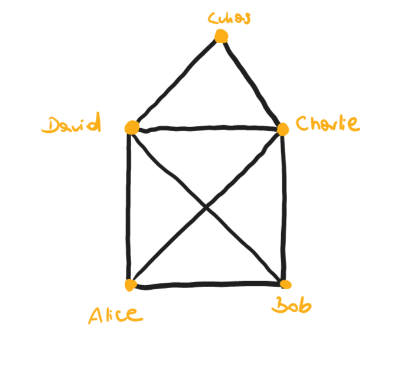
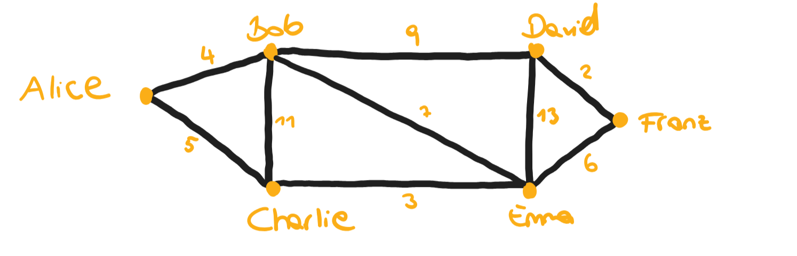
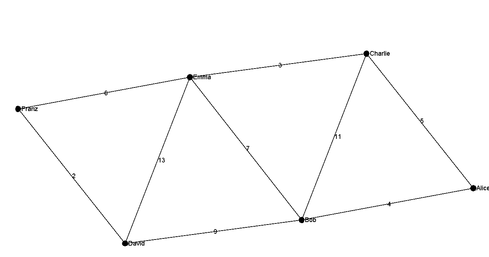
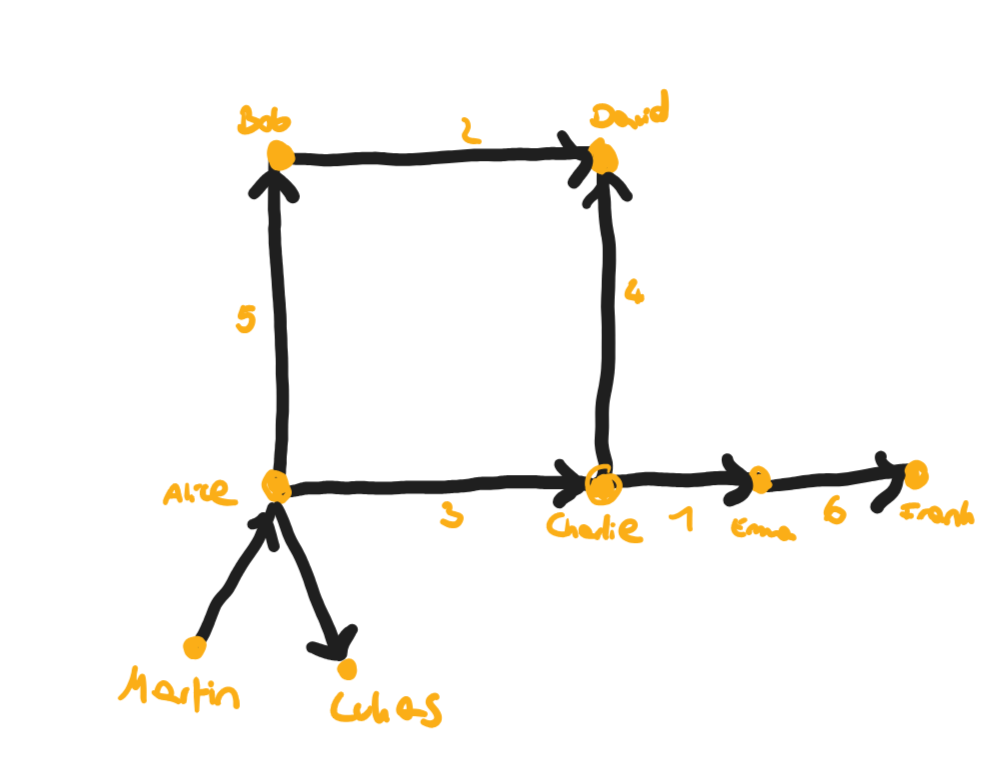
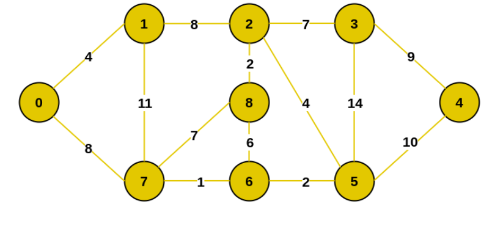
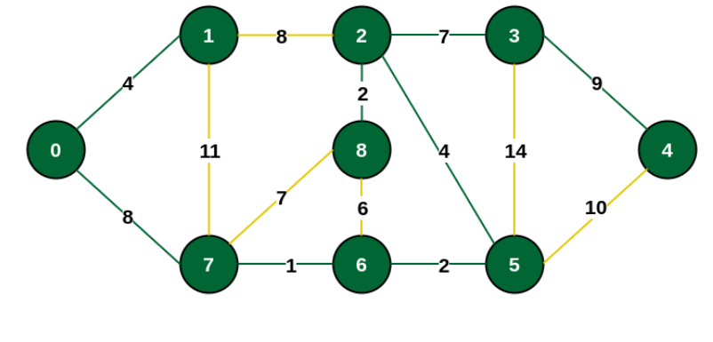

HouseOfNikolausGraph.txt  

ShortestPathGraph.txt  

UneulerianGraph.txt  

MinimumSpanningTreeGraph.txt

Result Prim minimum Spanning Tree:

Source:  https://www.geeksforgeeks.org/prims-minimum-spanning-tree-mst-greedy-algo-5/

